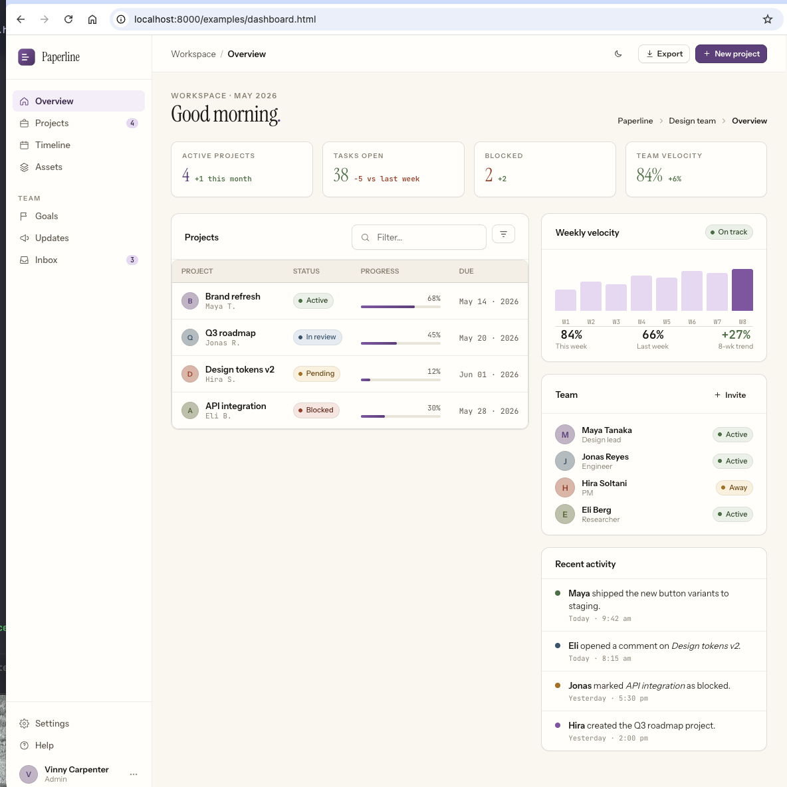
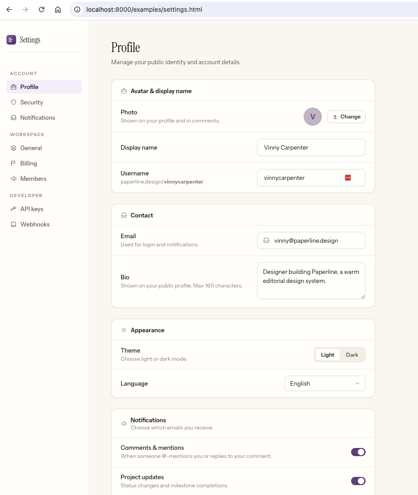

# Paperline

**[View the live demo →](https://vscarpenter.github.io/paperline/)**

Paperline is a warm, editorial design system for any app: paper-toned surfaces, slate near-black ink, refined plum accents, a tri-modal type stack (Instrument Serif for heads, the system sans stack for body, JetBrains Mono for metadata), curated 1.6-stroke icons, and small React primitives built on CSS variables.

## What's Included

```text
src/
  styles/paperline.css    Design tokens, themes, utility classes
  icons.jsx               ESM icon exports
  components.jsx          ESM React component exports
  index.jsx               Main package entry
dist/
  paperline.css           Copy-paste CSS artifact
  *.global.jsx            Browser globals for static demos
docs/
  index.html              Design system spec (all tokens, components, icons)
  standalone.html         Self-contained spec bundle
examples/
  browser.html            Minimal single-card integration
  dashboard.html          Product dashboard — sidebar nav, stats, table, activity feed
  settings.html           Settings page — profile form, toggles, danger zone, modal
  onboarding.html         Multi-step onboarding flow — plan picker, role selector, success state
```

## Live Examples

Open these in a browser (`npm run docs` → `http://localhost:8000`) to see the system assembled into realistic product screens:

| Example | What it shows |
|---|---|
| [`examples/dashboard.html`](examples/dashboard.html) | Sidebar nav, stat cards, filterable project table with progress bars, team member list, activity feed, and a CSS bar chart — all dark-mode toggleable. |
| [`examples/settings.html`](examples/settings.html) | Multi-section settings page with profile form, notification toggles, appearance picker, and a confirm-delete danger zone with a modal. |
| [`examples/onboarding.html`](examples/onboarding.html) | 4-step onboarding card flow: account creation, role picker, plan selector, and a success state with animated step dots. |
| [`examples/browser.html`](examples/browser.html) | Minimal single-card integration — the smallest possible starting point. |
| [`docs/index.html`](docs/index.html) | Full design-system spec: every token, component, and icon documented interactively. |

[](examples/dashboard.html)

[](examples/settings.html)

## Use the Tokens

Load the two web fonts (the body sans uses your system stack, no network cost) and the CSS, then apply `pl-root` to your application shell.

```html
<link href="https://fonts.googleapis.com/css2?family=Instrument+Serif:ital@0;1&family=JetBrains+Mono:wght@400;500;600&display=swap" rel="stylesheet" />
<link rel="stylesheet" href="dist/paperline.css" />
<body class="pl-root">...</body>
```

```css
.primary-action {
  background: var(--pl-accent-500);
  color: var(--pl-accent-ink);
  border-radius: var(--pl-r-md);
  box-shadow: var(--pl-shadow-sm);
  font-family: var(--pl-font-sans);
}
```

## Use the React Primitives

Paperline exports pre-compiled ESM and CJS and keeps React as a peer dependency. No bundler configuration needed.

```jsx
import "paperline/styles.css";
import { I, PLBadge, PLButton, PLStat } from "paperline";

export function DashboardHeader() {
  return (
    <div>
      <PLButton kind="primary" icon={I.Plus}>New project</PLButton>
      <PLBadge tone="ok" dot>Active</PLBadge>
      <PLStat label="Revenue" value="$48.2k" delta="+12%" tone="ok" />
    </div>
  );
}
```

## Browser-Only Usage

For prototypes or static pages, use the files in `dist/` with React, ReactDOM, and Babel Standalone:

```html
<link rel="stylesheet" href="dist/paperline.css" />
<script type="text/babel" src="dist/paperline-icons.global.jsx"></script>
<script type="text/babel" src="dist/paperline-components.global.jsx"></script>
```

## Full Usage Guide

See [`docs/USAGE.md`](docs/USAGE.md) for an end-to-end guide: bundled-React vs. static-HTML setup, the full token cheat sheet, every component's prop signature, and a section on driving Paperline from coding agents like Claude Code and Codex.

## Component Surface

The current `PL*` primitives, all exported from `paperline`:

- **Forms**: `PLButton`, `PLInput`, `PLTextarea`, `PLSelect`, `PLToggle`, `PLCheckbox`, `PLRadio`, `PLField`
- **Display**: `PLBadge`, `PLTag`, `PLCard`, `PLDivider`, `PLAvatar`, `PLAvatarGroup`, `PLProgress`, `PLSpinner`, `PLSkeleton`, `PLAlert`, `PLEmptyState`, `PLStat`, `PLTable`, `PLToast`
- **Navigation**: `PLTabs`, `PLBreadcrumbs`, `PLPagination`
- **Layout**: `PLStack`, `PLCluster`, `PLGrid`
- **Overlays**: `PLTooltip`, `PLMenu`, `PLModal`

Form primitives wrap real `<input>` elements (visually hidden via `.pl-sr-only`), so they're keyboard-operable, screen-reader-friendly, and submit with `<form>`. `PLModal` traps Tab focus, locks body scroll, and restores focus on close.

## Local Review

```bash
npm run build   # regenerates dist/ from src/
npm test        # structural + parity check
npm run docs    # serves the repo
```

`npm run build` regenerates the browser-global files in `dist/` from `src/`. `npm test` then verifies the package structure, the docs references, and that `dist/` is in sync with `src/`. `npm run docs` serves the repo at `http://localhost:8000`; open `docs/index.html` or `examples/browser.html`.

> Files inside `dist/` are generated. Edit `src/` and run `npm run build` — never edit `dist/*` by hand.

## Dark Mode

Add `pl-dark` or `data-theme="dark"` to any wrapping element.

```html
<div class="pl-root pl-dark">...</div>
```

## Design Principles

- Paper, not panels: warm surfaces, hairlines, and soft depth.
- Tri-modal type: serif for every heading, system sans for body, mono for metadata and eyebrows.
- Slate near-black ink on warm paper — cool over warm, the editorial classic.
- Plum is the only primary accent and should be used sparingly.
- Status colors are muted earth tones, never candy.
- Icons are one stroke, one set, and inherit `currentColor`.

## License

MIT. Created by [Vinny Carpenter](https://vinny.dev/).
